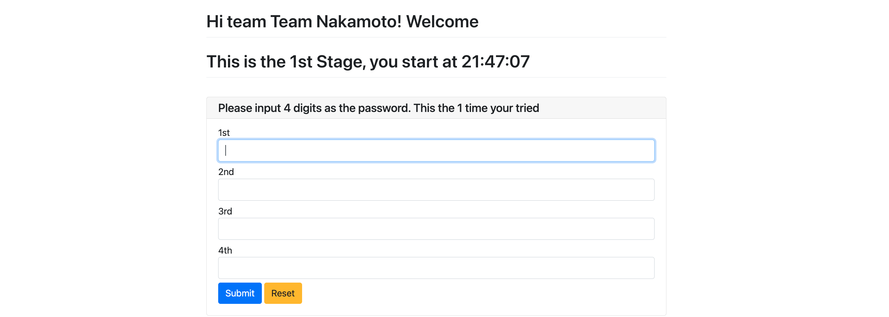

# PywebioApp in Escape room
Three digital locks will be used in an escape room. The team can input their team name and answer for each stages. They can also know their start time and the time they have taken.

## 1. prerequisite
Before you run the application, you need to have the python library： pywebio installed, which can be realized by running
`pip3 install pywebio`. I will recommend you to make use of virtual environment.

The application is running locally, with `8080` port, while this number can be set int the main function. it's also possible to run the app remotely, to realize this, you need to change the configuration `remote_access=False` as `True`.

## 2. where is the answer?
right now I only hard code the stage number as three. The answer is in the `answer.txt`. This file should have 3 or more than 3 lines, but only the first three lines will be read. And each line should only contain 4 numbers as password for the lock.

## 3. the code challenge
This is one of the stage of escape room. we have prepared four code snippet, which will produce a four-digit password for the lock.

- the code in under the folder `codechallenge`

## 4. some screenshots of the app
### 4.1 Login page

### 4.2 Input password page

### 4.3 Success page

## Reference
- https://pywebio.readthedocs.io/en/dev/guide.html
- https://www.well.ox.ac.uk/~johnb/comp/unix/ksh.html#functions